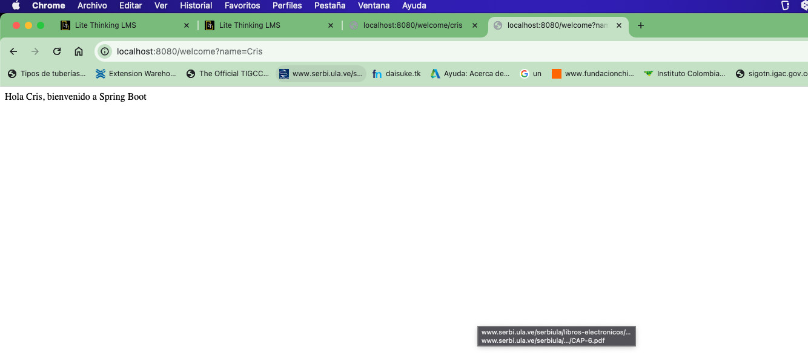

# Configuración de Spring Boot  
## Installation Java

## Local Version


# Retos practicos
## Reto 1
 1. Genera un endpoint REST que reciba por parametro una cadena de texto que representa un nombre. El endpoint debe responder “Hola %nombre, bienvenido a Spring Boot”

2. Incluye un archivo README.md con la siguiente información: - Captura de pantallas que muestren el proceso de instalación y versión de java que estás utilizando en tu máquina. - Instrucciones de ejecución del programa, incluyendo endpoints y firmas.

3. Incluye Health actuactor para monitorear el estado del microservicio

### Instrucciones de ejecución del programa
1. Para consumir el servicio se debe hacer una petición GET a la siguiente URL: 

```
http://localhost:8080/hola?nombre=nombre
```

2. La respuesta será un mensaje de bienvenida con el nombre que se envió como parámetro.

